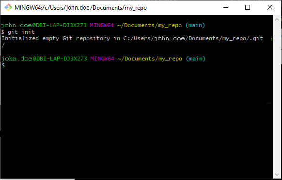
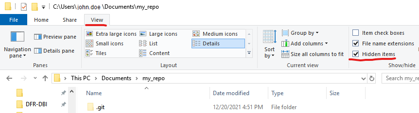
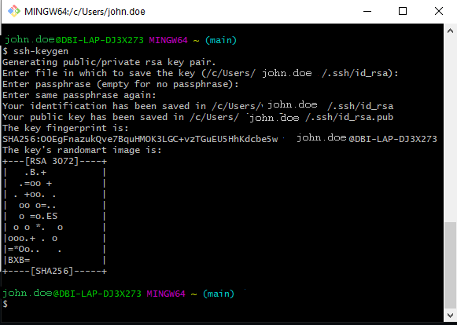
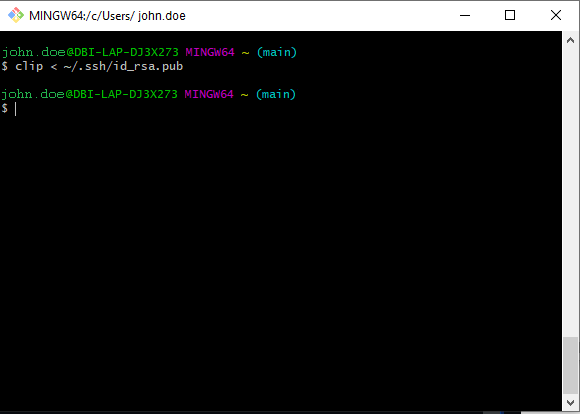
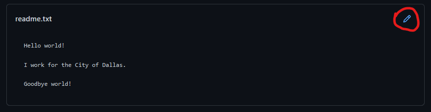

DBI Git Tutorial
================

## Agenda

The purpose of this training is to provide DBI members with a brief
introduction to Git and GitHub. Upon completion of this training,
trainees should be broadly familiar with each of the following concepts:

1.  Creating local and remote repositories
2.  Making commits
3.  Cloning from and pushing to remote repositories
4.  Creating and merging Pull Requests

Think of this as a “crash course”, rather than a comprehensive
Git/GitHub tutorial. Git is powerful but complex tool, and we will only
cover the bare minimum necessary to get you started with using it. We
will not cover many advanced Git topics such as rebasing, branching
strategies, or dealing with merge conflicts. There are many free online
resources that will provide a more detailed overview of such topics,
several of which are available on [Git’s official documentation
page](https://git-scm.com/doc). In fact, much of this tutorial draws
directly from the [Pro Git book](https://git-scm.com/book/en/v2), one of
the first resources listed on the page.

## Prerequisites

Before beginning this training you will need:

1.  An installation of [Git for
    Windows](https://git-scm.com/download/win) on your local machine
2.  A verified [GitHub
    account](https://github.com/signup?ref_cta=Sign+up&ref_loc=header+logged+out&ref_page=%2F&source=header-home)

# Part 1: Introduction and Set-up

## Definitions

**Git** is a software version control system, typically used to track
changes in source code and plain text, but it can be used for any type
of file. A folder that is managed by Git is referred to as a
**repository** or **repo**. Repositories can be either **local**,
referring to a folder or files on your computer, or **remote**,
referring to a folder or files on a server or website such as GitHub.

Changes to files within a Git repo are called **commits**. Such changes
serve as historical snapshots of the repo over time, and users can view
or revert any changes back to these snapshots as necessary. Creating a
commit is a separate action from simply saving a file. You can save a
file as many times as you like, but Git will not create a commit unless
you specifically tell it to.

By design, Git is a *distributed* system, meaning that multiple people
can have separate copies of the same Git repository on their individual
machines. Using Git, each person can make changes to files without
affecting anyone else’s copies of those files. Later on, differences
between each copy of the repo can be consolidated using Git’s built-in
merging tools.

**GitHub** is commercial website that hosts Git repos. It provides an
intuitive web interface and a variety of helpful extensions to Git, such
as security access controls and **Pull Requests**, which allow users to
easily combine changes between their individual copies of a repo.

## Git Bash

Git can be used from a number of different interfaces or “frontends”.
For example, many popular text editors and IDEs like RStudio, VSCode,
and PyCharm come with built-in Git/GitHub support.

While you are welcome and encouraged to use these tools as you see fit,
for consistency’s sake, this tutorial will use Git’s “backend”, which is
included with every installation of Git: the command line interface.

The command line interface can be accessed by clicking on the start menu
and typing **Git Bash** into the search bar.


Git Bash is a way of interacting with your computer by typing in
commands or the names of programs, rather than clicking around the
desktop. Most of the commands we will use today begin with the word
`git`, but there are a number of other commands that you may find useful
from time to time:

-   `cd` - short for “**c**hange **d**irectory”, is used to navigate
    folders by name. For example, try typing `cd Documents` into Git
    Bash, then hit enter. This will navigate to your Windows Documents
    folder.

-   `pwd` - short for “**p**rint **w**hich **d**irectory”, tells you the
    name of the folder in which Git Bash is currently opened. For
    example, if you ran the `cd` example above to navigate to your
    Windows Documents folder, entering in `pwd` will show the full path
    to the folder:

    ``` sh
    /c/Users/[YOUR.NAME]/Documents
    ```

-   `mkdir` - short for “**m**a**k**e **dir**ectory”, creates a new
    folder within the current folder:

    ``` sh
    mkdir my_folder
    ```

-   `ls` - short for “**l**i**s**t”, shows you all of the files and
    folders within the current directory.


## Configuring Git

Before we get started using Git we will need to run a few startup
commands. We will only need to run these “configuration” commands once.

First, we will set a user name, which Git will use to “sign” every
commit we make. Copy the command below into Windows Notepad or another
editor, swap in your own name, paste them into Git Bash\*, and hit
enter:

``` sh
git config --global user.name "John Doe"
```

Next, we will need to set our default text editor, which we will use to
write summary messages for each commit we make. For this tutorial we
will use Windows Notepad, but feel free to use any editor\*\* you like.
Copy and paste the line below into the command prompt:

``` sh
git config --global core.editor notepad
```

Once you’ve run all of these commands, you can close out of Git Bash.

<font size = "3">*\*Tip: To paste into the Git Bash command prompt,
either right click on the prompt and select paste, or type
`shift+insert`*

*\*\*Avoid “rich text editors” such as MS Word or WordPad, as they can
distort the commands we enter into Git Bash*</font>


# Part 2: Local Repositories

## Creating Local Repositories

We are now ready to create our first Git repository. We will begin by
creating a **local** repository on our desktop. Later on, we will create
a **remote** copy of this repository on GitHub.

Create a new folder somewhere on your computer and open it up in the
File Explorer. Right click anywhere within the folder and select **Git
Bash Here** in the context menu. A new command prompt will appear, just
like what we saw in Part 1 except this one shows the path to your new
folder somewhere in the prompt, e.g. `~/Documents/my_repo`.

Within the command prompt, type `git init` and then hit enter. Now if
you go back to your folder in the File Explorer, you should see a new
folder within it labelled `.git`. If you do not see this folder, click
on the View button at the top right of the File Explorer and check the
box labelled “Hidden items”.






**Congratulations! You’ve just created your first Git repository!**

## Tracking Files with Git

Now that we have a git repository, we can start using it to track
changes in files.

Let’s start by creating a new file in our repo folder: `readme.txt`.
Open up this file in Notepad (or another editor) and paste in the
following lines (including the misspellings, which we will deal with
later):

    Hello world!

    i work for th City of Dalas

Re-open Git Bash in your repo if it’s not open already (*right click
&gt; Git Bash Here*) and type `git status` into the prompt. You should
see the message `No commits yet` somewhere in the prompt, as well as the
`readme.txt` file we just created in red text, below the line that says
`Untracked files`.


## Staging Commits

Tracking files within git requires two separate steps: *staging* and
*committing*. The *staging* step allows us to select which specific
files or changes we want to include in a given snapshot, which can be
helpful when we are working on multiple files at once but only wish to
track changes in a subset of them. Once we have staged all the files we
wish to include in our snapshot, we can *commit* them to Git’s history,
which will allow us to view the files in the state they were in when we
created the commit.

To add our `readme.txt` file to our Git repository’s history, first copy
and paste the following line into Git Bash:

``` sh
git add readme.txt
```

Now if you run `git status` again, you should see the name of the
`readme.txt` file again, this time highlighted in green under the line:
`Changes to be committed:`. This indicates that our file is now *staged*
and ready to be *committed.*


## Writing Commit Messages

We are now ready to create our first commit. To create a commit, simply
type `git commit` into Git Bash and hit enter.

Git will automatically launch Windows Notepad (or whichever editor you
selected earlier) with a file already opened: `COMMIT_EDITMSG`. This is
the last step in creating a commit. This file opens every time you make
a commit, allowing you to include a brief, descriptive summary of
changes included with the commit.


Since this is this is the first commit we are making to this repo, and
there are no “changes” to summarize, we can simply uncomment line 7,
`Initial commit` by removing the `#` character, as shown below. You do
not need to remove the other `#` commented lines in the commit message,
as these will be automatically ignored.

    #
    Initial commit
    #

Save the file and close out of Notepad.

**Congratulations! You’ve just created your first commit!**

## Comparing commits

Let’s create a new commit. Open up the `readme.txt` file once again,
fixing the spelling issues in the third line like so:

    Hello world!

    I work for the City of Dallas.

Now if you use the `git status` command, underneath the line:
`Changes not staged for commit:`, you should see a line in red text:
`modified:    readme.txt`. This indicates that Git is aware of our
changes, but the changes have not yet made it into Git’s history.


Type `git diff readme.txt` into the command line. Notice that git prints
out both the original line `i work for th City of Dallas` in red and the
corrected line `I work for the City of Dallas` in green. This `git diff`
command allows us to see exactly what has changed since our last commit.


Just like before, run the commands `git add readme.txt` and `git commit`
in Git Bash. For our commit message, we can simply type `Fix typos` in
the first line. You can then save the file and close out of Notepad.


## Browsing commit histories

To view commits for a given repo, use the command `git log`. For each of
the commits you just created, Git will print your name as you entered in
Part 1, along with the date of the commit and the commit message. The
long string of numbers and letters in the first line is a unique
identifier for each commit, and can be used for more advanced Git
management not covered in this tutorial.


# Part 3: GitHub and Remote Repositories

## Creating SSH keys

Now that we’ve learned the basics of Git, we can transition over to
GitHub, where we will host a public copy of our new repo. But before we
can do that, we will need to create an [SSH
key](https://docs.github.com/en/authentication/connecting-to-github-with-ssh)
and associate it with our GitHub account. This key will allow us to
interact with GitHub from our local computer via Git Bash (or any other
Git program).

To create an SSH key, open up Git Bash and copy and paste the following
line into the prompt.

``` sh
ssh-keygen
```

When asked to `Enter file in which to save the key`, simply hit enter
again. You may optionally enter in a passphrase into the next prompt, or
simply hit enter twice to move on. If you choose to use a passphrase,
you will need to enter this passphrase anytime you interact with GitHub
from Git Bash. Refer to GitHub’s [SSH
documentation](https://docs.github.com/en/authentication/connecting-to-github-with-ssh/working-with-ssh-key-passphrases)
pages for details and workarounds.



## Adding SSH keys to GitHub

To add your SSH key to your GitHub account, first log into GitHub if you
haven’t already, then click on the **+** icon in the top right corner.
Under the pop-up menu, click on **Settings**. A new page will open with
a list of Account settings on the left. Click on the **SSH and GPG
keys** option.


Here you can see a list of all SSH keys associated with your account, if
you have any. Click **New SSH key** at the top right. Enter a name/title
for your key. As a general rule, this should be a name that you can use
to identify your current computer vs any other computer you might be
using with GitHub, e.g. **DBI\_laptop**. In the text-entry box under
**Key**, we will need to copy and paste our public SSH key.

To add your public SSH key, open up Git Bash again and paste in the
following command.

``` sh
clip < ~/.ssh/id_rsa.pub
```



Now go back to GitHub, right click somewhere in the **Key** text-entry
box, and paste. A long string of numbers should appear. Click **Add SSH
key** to confirm your entry.


## Creating remote repositories

To create a remote repository on GitHub, click the **+** button in the
top right again, then click on **New repository**.

You will be taken to GitHub’s repo creation page. Enter a name for your
repo (it does not need to be the same name as your local folder) and
optionally enter in a Description. Select **Public**, and leave each of
the boxes under the **Initialize this repository with:** section
unchecked. Now click **Create repository**.


## Pushing local repositories

Now we can copy or *push* our local repository into our newly-created
GitHub repository. To do this, first click on the **SSH** button at the
top of the page, then copy the three commands under the section labelled
**…or push an existing repository from the command line**.


On your desktop, go to your local repo in the File Explorer and re-open
Git Bash (*right click &gt; Git Bash here*). Paste in the three lines
you just copied from GitHub and hit enter. If you set a passphrase when
creating your SSH key earlier, you will need to re-enter this passphrase
in the prompt.


Refresh GitHub in your browser. The page now shows the readme.txt file
we created earlier, along with a preview of its contents, indicating we
have successfully uploaded our local repository onto GitHub.


**Congratulations! You’ve just pushed your first repo onto GitHub!**

We’ve now pushed our local repository onto our remote, but what what
happens if we make more changes on our local repo? Let’s try adding a
new line to our `readme.txt` file, so it looks like this:

    Hello world!

    I work for the City of Dallas.

    Goodbye world!

As before, we will *stage* our changes using `git add readme.txt`,
*commit* them via `git commit`, then enter in a commit message. Now
refresh your repo page on GitHub.


The page has not changed; we don’t see the additional line we just
added, and the newest commit still says `Fix typos`. What’s going on
here?

If you recall from the introduction, Git is a **distributed** version
control system, meaning that multiple copies of a Git repo can exist in
multiple locations and can be worked on independently. In this case,
there are two copies of the repo, one on our local machine, and the
other on GitHub. These two will not be synchronized unless we
specifically tell Git to do so.

Luckily, synchronization can be achieved with a single command:

``` sh
git push origin
```

This `git push` command is how we tell Git to synchronize our local
repository with our remote repository. Here, `origin` refers to our
GitHub repo, and is a “nickname” that GitHub chose for us by default
when we first pushed our local repository, but we could have easily
chosen a different name. It is also possible to have multiple remote
copies, each with their own “nicknames”, but that is outside of the
scope of this tutorial.


Run the command in Git Bash. Refreshing GitHub now reflects our newest
commits:


## Cloning remote repositories

To *clone* a remote repository is to create a copy of it onto your local
machine. You can clone any repository from GitHub onto your local
machine by clicking on the **Code** button at the top right of the repo
page. In the popup menu, copy the line of code in the text box starting
with `git@github.com`. Open up Git Bash and type `git clone` into the
prompt (be sure to include the space after `clone`). Then simply paste
in the code you copied from GitHub and click enter. The repo will be
copied into whatever folder in which you opened Git Bash (*Hint: Look at
the window title at the top of Git Bash*).


For example, this tutorial is hosted on GitHub
[here](https://github.com/DallasDBI/DBI_Git_Tutorial), and can be cloned
onto your local machine using the following line:

``` sh
git clone git@github.com:DallasDBI/DBI_Git_Tutorial.git
```


# Part 4: Pull Requests

## Pull Requests

Pull Requests or PRs are a GitHub feature to facilitate merging
repositories together. As we’ve discussed already, Git is a
**distributed** version control system. As such, multiple users can have
separate copies of a Git repo upon which they each work indepentently,
resulting in different commits at different times, often on the same
files. Pull Requests leverage Git’s built-in merging tools to
consolidate these divergent “commit histories” into one. At their core,
Pull Requests rely on a feature built in to Git known as **branches**.

## Git Branches

Every Git repository consists of one or more **branches**. By default,
the first branch Git creates is the **master** branch\*, but a repo may
consist of any number of branches, each of which may have a completely
different history of commits. Consider the following diagram:


Here, each circle represents a commit. Each arrow points to the next
commit in chronological order. The bottom line is the **master** branch,
which diverges after the second commit into a *parallel* set of commits
under the branch name **bugfix**. Notice how, after the second
**bugfix** commit, the last arrow, labelled **Pull Request**, points to
the last commit of the **master** branch, indicating that the two
branches have converged back into a single branch containing the commits
from *both* branches.

<font size = "3">*\*More recent versions of Git have changed the default
branch to main, which is also the default branch on GitHub. Depending on
when you installed Git, the repo you created earlier may be labelled
main instead of master.*</font>

This merging functionality also applies when merging together two
**master** branches, which happens when two people are working on
separate copies of the same repo, as in this diagram:


Here, there are two master branches: the original, created by Victor,
and another, created by Jacob after the third commit. As before, we can
use a Pull Request to merge together the two branches.

## Creating Pull Requests

Let’s create our own Pull Request. First, we need to create a new branch
by clicking on the icon in the top left of our GitHub repo labelled
**main**. In the pop-up text menu, type the name of a new branch,
e.g. **mybranch**, then click on the option **Create branch: mybranch
from ‘main’**.


Git will automatically switch to the new branch, which for now is
identical to the current **main** branch. Let’s create a new commit by
clicking on the pencil icon in the top right of `readme.txt` file
preview.



As with creating commits in Git Bash, you can type in a commit message
in the next two fields. By default, GitHub prefills your commit message
as `Update readme.txt`, but you are welcome to change this to whatever
you prefer.

GitHub will open up a new editing window with the text of our
`readme.txt` file pre-entered. We can use this page to modify the file
and create a brand new commit, all within GitHub. Add the following line
at the bottom of the editor pane:

    This is a Pull Request.


Now if we go back to our main repo page, we should see a new pop-up at
the top labelled **Compare & pull request**.


Clicking on this will take you to GitHub’s Pull Request page. You can
enter a name for your pull request in the first textbox and add comments
in the second one, if you’d like. Also note that, like the `git diff`
command we used earlier, GitHub shows us exactly which lines changed
between the **main** branch version of our `readme.txt` file and the
**mybranch** version of the file.


When you are ready, click on the **Create pull request button**.

## Merging Pull Requests

The final step in the Pull Request process is to merge the two branches.
GitHub’s Pull Request merge page is designed with collaborative code
editing in mind, serving as a single place for multiple users to review
and discuss changes within a Pull Request, and also deal with any
conflicts that may arise when merging more complex differences between
branches.


Since the changes we made are small and conflict-free, as GitHub
helpfully points out, we can simply click the **Merge pull request
button** to run the merge. The page will then update, marking the Pull
request as **Merged**. Now that we’ve merged in our changes, feel free
to delete **mybranch**.


**Congratulations! Not only have you successfully merged your first Pull
Request, you have completed the DBI Git Tutorial!** If you haven’t done
so already, please visit through the
[DallasDBI](https://github.com/DallasDBI/DallasDBI) repo for an in-depth
overview of the DallasDBI GitHub Organization, as well as guidelines for
DBI members using Git/GitHub.

## Additional Resources

-   [Pro Git](https://git-scm.com/book/en/v2)
-   [GitHub Docs](https://docs.github.com/en)
-   [Git Cheatsheets](https://training.github.com/)
-   [Git Bash
    Tutorial](https://www.atlassian.com/git/tutorials/git-bash)
